# MobileGen3D: Text-Guided Real-World-to-3D Generation with Real-Time Rendering on Mobile Devices

> **[Text-Guided Real-World-to-3D Generation with Real-Time Rendering on Mobile Devices](https://github.com/tuanvu171/MobileGen3D)** \

<div align="center">
  <table>
    <tr>
      <td align="center">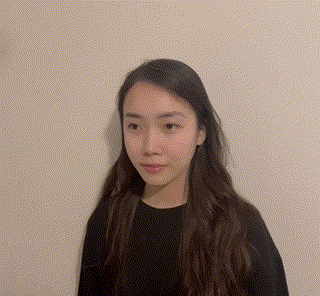</td>
      <td align="center">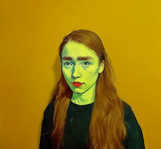</td>
    </tr>
    <tr>
      <td align="center">Original Content</td>
      <td align="center">"Turn her to Van Gogh"</td>
    </tr>
  </table>
</div>

<div align="center">
  <table>
    <tr>
      <td align="center">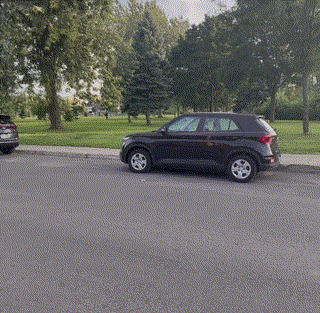</td>
      <td align="center">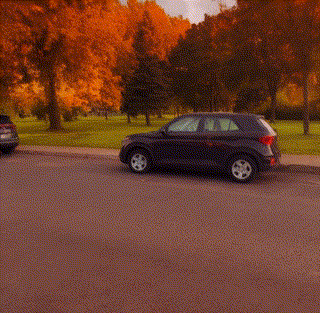</td>
      <td align="center">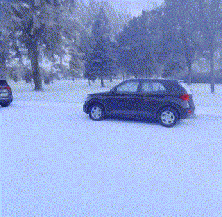</td>
      <td align="center">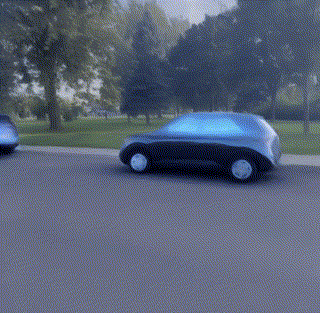</td>
    </tr>
    <tr>
      <td align="center">Original Content</td>
      <td align="center">"As Canada Autumn"</td>
      <td align="center">"Covering by snow"</td>
      <td align="center">"Turn the car to digital world"</td>
    </tr>
  </table>
</div>

<div align="center">
  <table>
    <tr>
      <td align="center">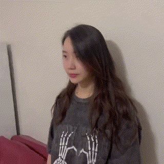</td>
      <td align="center">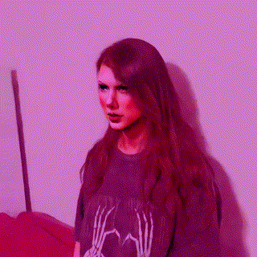</td>
      <td align="center">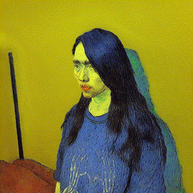</td>
      <td align="center">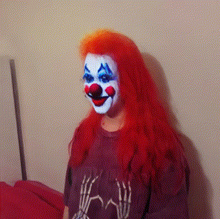</td>
    </tr>
    <tr>
      <td align="center">Original Content</td>
      <td align="center">"A painting of Taylor Swift"</td>
      <td align="center">"A man in Van Gogh style"</td>
      <td align="center">"As Joker with red hair"</td>
    </tr>
  </table>
</div>


# Overview
This repo includes the code for the implementation of MobileGen3D. At least one NVIDIA GPU is required for the deployment.

Depending on the size of the training images, the training time may vary. For 800x800 images, training the initial NeRF model should take less than 1 hour with 1 GPU. It takes another 2-3 hours to train Instruct-NeRF2NeRF, and from 1-2 days for the final NeLR model.

The workflow of MobileGen3D is as follows:

<div align="center">
    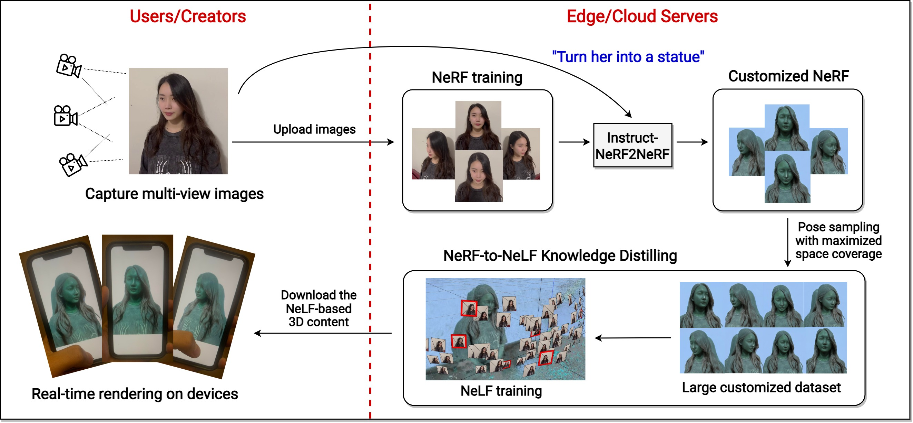
</div>


And this is the network architecture regarding real-time on-device rendering:

<div align="center">
    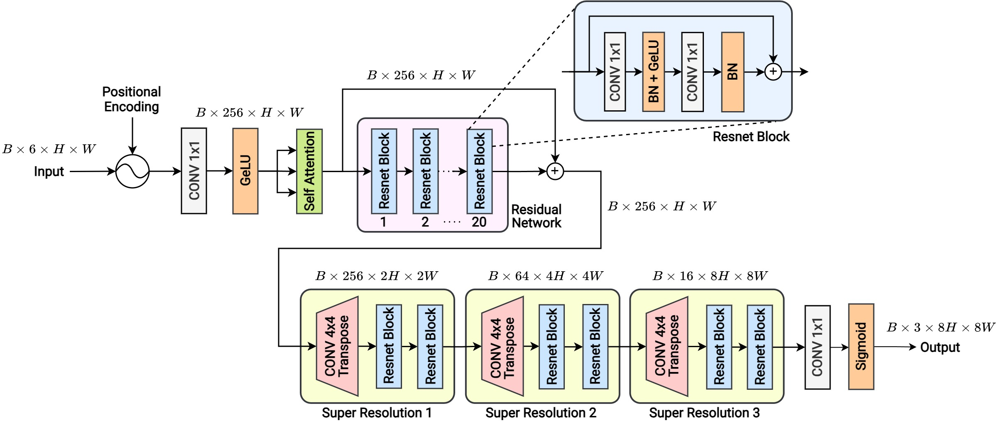
</div>

# Installation

## MobileGen3D Installation
```
git clone https://github.com/tuanvu171/MobileGen3D.git

cd MobileGen3D

conda create -n MobileGen3D python==3.9
conda activate MobileGen3D

pip install torch torchvision torchaudio
pip install -r requirements.txt 

```

## NGP_PL
Before installing ngp_pl, you must switch your cuda version to 11.6 to make it compatible with torch.
```
cd model/teacher/ngp_pl

# create the conda env
conda create -n ngp_pl python==3.9
conda activate ngp_pl
conda install pip

# install torch with cuda 116
pip install torch==1.13.1+cu116 torchvision==0.14.1+cu116 torchaudio==0.13.1 --extra-index-url https://download.pytorch.org/whl/cu116

# install tiny-cuda-nn
pip install git+https://github.com/NVlabs/tiny-cuda-nn/#subdirectory=bindings/torch

pip install torch-scatter -f https://data.pyg.org/whl/torch-1.13.0+${cu116}.html

# ---install apex---
git clone https://github.com/NVIDIA/apex
cd apex
pip install packaging

pip install -v --disable-pip-version-check --no-cache-dir --no-build-isolation --config-settings "--build-option=--cpp_ext" --config-settings "--build-option=--cuda_ext" ./


cd ../
pip install -r requirements.txt

# build
pip install models/csrc/

# back to root
cd ../../../
```

## NeRFstudio
Before installing, make sure that you have switched cuda to 11.8 with g++ 11.3.
```
conda create --name nerfstudio -y python=3.8
conda activate nerfstudio

pip uninstall torch torchvision functorch tinycudann

# install torch with cuda
pip install torch==2.0.1+cu118 torchvision==0.15.2+cu118 --extra-index-url https://download.pytorch.org/whl/cu118

# install cuda toolkit if needed
conda install -c "nvidia/label/cuda-11.8.0" cuda-toolkit

# install tiny-cuda-nn
pip install ninja git+https://github.com/NVlabs/tiny-cuda-nn/#subdirectory=bindings/torch

# nerfstudio
pip install nerfstudio
```

# Implementation

## Using Colmap to process images/videos
We provided an example of a real-world scene/content at "real-world-scenes/original/woman-512". To extract camera poses and other intrinsic camera parameters, we must run Colmap:

```
conda activate nerfstudio

# our provided example is a video capturing a woman
ns-process-data video --data real-world-scenes/original/woman-512/woman-512.mp4 --output-dir ./real-world-scenes/processed-colmap/woman-512
```

## Train the initial NeRF model and Instruct-NeRF2NeRF
With the extracted images and poses, we can train the first NeRF model that does not apply any customization on the scene/content. Here, we use a NeRF model named nerfacto offered by nerfstudio. Then, we use Instruct-NeRF2NeRF to customize the content according to a desirable textual instruction.

```
cd in2n

# train the first NeRF model
ns-train nerfacto --data ../real-world-scenes/processed-colmap/woman-512

# train in2n with a text prompt.
# You MUST replace the {date} in the load-dir with the actual date indicated in your chosen nerfacto model's folder
ns-train in2n --data ../real-world-scenes/processed-colmap/woman-512 --load-dir outputs/woman-512/nerfacto/{date}/nerfstudio_models --pipeline.prompt "Make her look like Van Gogh" --pipeline.guidance-scale 7.5 --pipeline.image-guidance-scale 1.5
```
Optionally, we can modify the text prompt based on our desired effects. We can also change the guidance-scale of the provided text prompt to adjust the level of impact that the prompt has on the results. Similarly, image-guidance-scale can also be adjusted.

Congratulation! We already got the well-trained customized NeRF according to our text prompt! Now, we will generate images of the customized 3D content:
```
# generate images based on the poses of the original training images
ns-render interpolate --load-config outputs/woman-512/in2n/{date}/config.yml --output-path ./renders/woman-512/images --output-format images --interpolation_steps 1 --pose-source train
```

(OPTIONAL) We can also generate a video instead of images:
```
# adjust the number of interpolation steps to make the video smooth
ns-render interpolate --load-config outputs/woman-512/in2n/{date}/config.yml --output-path ./renders/woman-512/woman-512.mp4 --output-format video --interpolation_steps 20 --pose-source eval
```

Resize the generated images properly and store it in a suitable folder for later tasks:
```
python process-images.py

# go to root
cd ..
```
You can also go to the .py file and change the scene's name and resolution. In our example, the scene_name is "woman-512" with 512x512 resolution.

## Train instant-ngp to act as an effective and fast teacher
We train instant-ngp to generate the large pseudo dataset, which is then used to train the final MobileGen3D model.
```
cd llff

# extract poses and bounds from the images generated by the customized NeRF
python imgs2poses.py ../dataset/nerf_data/woman-512

cd ../model/teacher/ngp_pl

conda activate ngp_pl

# train the model
sh script/run-train.sh woman-512

# distill knowledge (i.e., images) from the model
sh script/distill.sh woman-512
```

If imgs2poses.py returns "ERROR: the correct camera poses for current points cannot be accessed", it's likely that Colmap cannot infer poses from your generated images. You should try another instruct-nerf2nerf model with different text prompt or guidance scale. The final results should be consistent so that Colmap can process them.

(OPTIONAL) We can also config the training/distilling process by modifying the two files run-train.sh and distill.sh, or directly execute:
```
# train the model
python3 train.py \
    --root_dir ../../../dataset/nerf_data/woman-512 \
    --exp_name woman-512  --dataset_name colmap\
    --num_epochs 25 --scale 1 --downsample 1  --lr 2e-2 --ff

# distill knowledge
python3 train.py \
    --root_dir ../../../dataset/nerf_data/woman-512 \
    --exp_name Pseudo_nhi-512 --dataset_name colmap\
    --scale 1 --downsample 1 --ff \
    --save_pseudo_data \
    --n_pseudo_data 5000 --weight_path ckpts/colmap/woman-512/epoch=24_slim.ckpt \
    --save_pseudo_path Pseudo/woman-512 --num_gpu 1 --sr_downscale 8
```
Changing "n_pseudo_data" to make it generate more/fewer images for the pseudo dataset. If you have more than 1 GPU, you can config "num_gpu".

```
# go to root
cd ../../../
```

## Train the final MobileGen3D's NeLF model and export to onnx files

```
# train the model
sh script/run-train.sh 1 woman-512

# export onnx files
sh script/export-onnx.sh 1 woman-512
```

With the onnx files, you can import the 3D model into your own mobile applications or websites.

# On-Device Rendering
I provided three onnx files as an example for rendering, which includes "ckpt_SnapGELU.onnx", "Sampler.onnx", and "Embedder.onnx". Firstly, you must go [here](https://ar.snap.com/download) to download Lens Studio. Then, download the example lens studio project [here](https://github.com/Snapchat/snapml-templates/tree/main/Neural%20Rendering/Lens%20Studio%20Projects/360).

- Once finishing the installation, run Lens Studio, click "Open Project" and choose the downloaded example project. In the project, go **File**-->**Import** and select the three example onnx files. For "Sampler.onnx" and "Embedder.onnx", you can simply click "Import". But for "ckpt_SnapGELU.onnx", you must change the three "Scale" of the **output** (not input) Channels to 255:
<div align="center">
    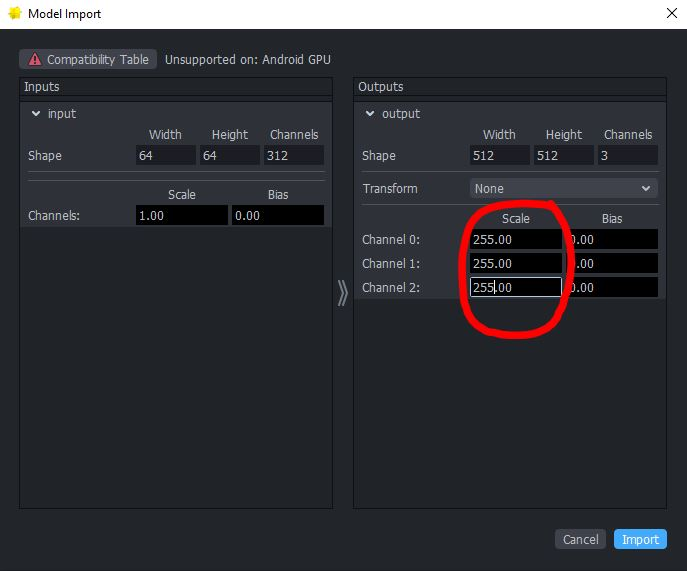
</div>

- There are three "ML Component" in the top-left panel. In the "Inspector" tab, click on the first "ML Component" and change the model to our imported "ckpt_SnapGELU". The second "ML Component" should be our imported "Embedder" and the third is "Sampler":
<div align="center">
    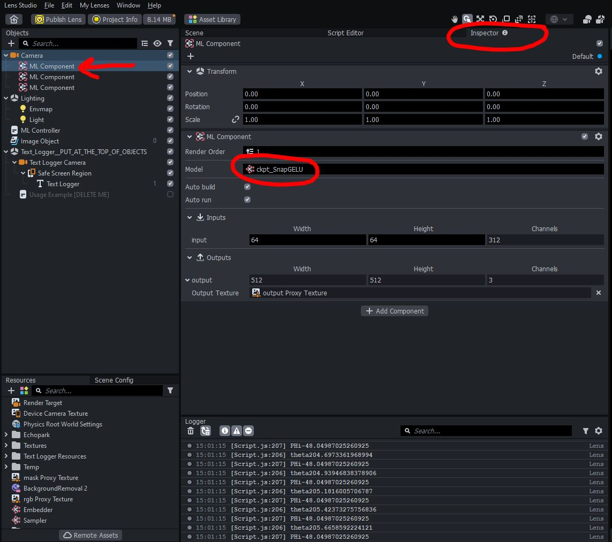
</div>

- Go to **Resources**-->**Script** on the down-left panel and modify the parameters used in our model. It can be found in the directory: ```logs/Experiments/your-experiments-folder/intrinsics.json```. Because you did not train the provided example model, I provided you with the following parameters:
```
{
  "H": 64,
  "W": 64,
  "focal": 64.92292785644531,
  "radius": 0.6790429949760437,
  "near": -3.261752128601074,
  "far": 5.6894731521606445,
  "n_sample": 8,
  "numtires": 6
}
```

- Ctrl+S to save the script and it will automatically render the scene in the Preview panel:
<div align="center">
    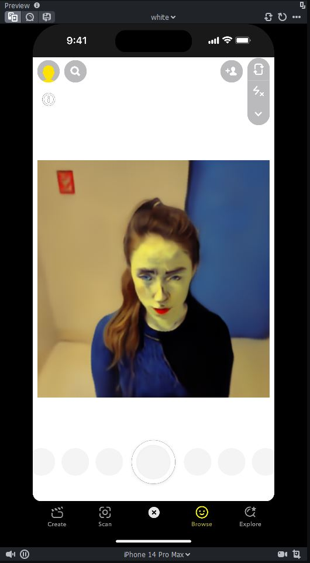
</div>

- Open SnapChat in your mobile phone and scan it with the model in Lens Studio. Finally, you can render the customized 3D scene on your own mobile device:
<div align="center">
    
</div>

Looks good! This scene has been customized by the prompt "Turn her into Vangogh Style". The scene doesn't look really sharp because I stopped training very early (as it is just for example). I used my iPhone 11 for this example, which is different from the one used in the paper's experiments. The numerical results in the paper is carried out differently with this example to make it more correct.

# Train your own scene
You can also use your own scene/content to generate 3D customizable model. Firstly, capture images or a video of the scene from different viewing directions. However, it worth noting that the way you capture images impacts enourmously to the rendering results! Therefore, we recommend new users to start with a video (~30 seconds) for the ease of usage. The video should capture different views, but you should try to avoid capturing some views too densely and some others too sparse.

Once sucessfully capturing the video, we must process it to reduce the number of frames and to resize it properly:
```
ffmpeg -i /path/to/the/input/{video-name}.mp4 -vf "fps=2,scale=512:512" real-world-scenes/original/{video-name}.mp4
```

Then, you can go back to the first stage:
```
conda activate nerfstudio

ns-process-data video --data real-world-scenes/original/{scene-name}/{video-name}.mp4 --output-dir ./real-world-scenes/processed-colmap/{scene-name}
```

Or if you use images:
```
conda activate nerfstudio

ns-process-data images --data real-world-scenes/original/{scene-name} --output-dir ./real-world-scenes/processed-colmap/{scene-name}
```

# Tips and Recommendations
- The Instruct-NeRF2NeRF model works better with a resolution less than or equal 512x512. For larger resolution, the customization results may not as desire and can lead to low-quality 3D model.
- If you stuggle with tinycudann installization, considering adjusting the torch and cuda version. Make sure that cuda and g++ are compatible with each other. For example, cuda 11.8 should go with g++ 11.3, while cuda 11.6 could go with g++ 9.3. You can also use spack to switch g++ versions: https://jchuynh.medium.com/how-to-solve-cuda-incompatibility-with-high-versions-of-gcc-f47ef966bb15
- The recommended number of real-world images should be around 60 to 100 images. Using too many images can lead to a higher training time and maybe lower customization effect.
- If you use videos to run Colmap and the number of frames is too high (i.e., the videos are too long), you can first use FFmpeg to reduce the fps of the videos before using Colmap. For example: ffmpeg -i /home/necphy/VuTruong/WCNC/MobileGen3D/real-world-scenes/original/woman-512/woman-512-360.mp4 -vf "fps=2" -strict -2 /path/to/output/video.mp4

# Acknowledgement

For building this code, we would refer to the following wonderful implementations: [Nerfstudio](https://github.com/nerfstudio-project/nerfstudio), [Instruct-NeRF2NeRF] (https://github.com/ayaanzhaque/instruct-nerf2nerf), [MobileR2L] (https://github.com/snap-research/MobileR2L/tree/main).

# Reference

If you find that our work and code help you, please consider to cite our paper. Thank you!!
```
